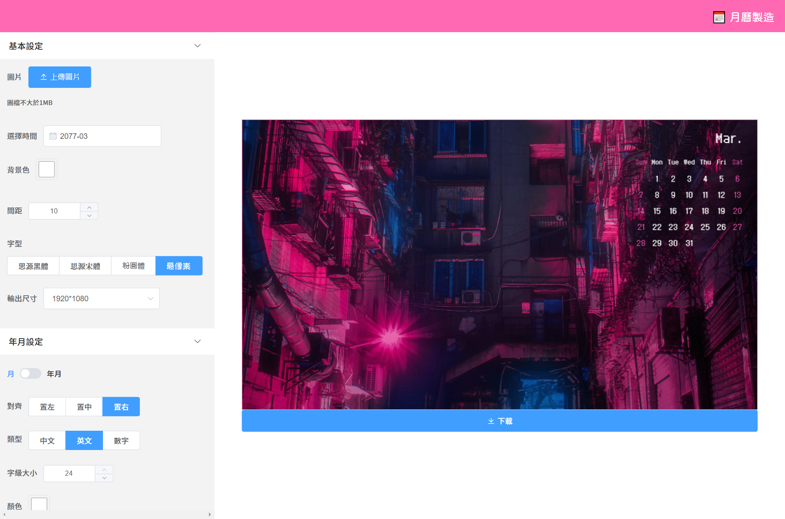

# 月曆製造 Calendar Maker

## ✔️功能
- 任何年月的月曆
- 自訂月曆樣式
- 上傳圖片
- 串接 [Unsplash](https://unsplash.com/) 的專業攝影圖
- 簡單的拖曳縮放排版
- 輸出多種常見尺寸(歡迎提供輸出尺寸)

## 📋TODO
- 圖片尺寸最適化 canvas
- snap 圖片拖拉吸附
- 假日導入
- 快速色票

## ✍️註解
- 月曆網格  
    - **daycount**: 當月天數  
    - **offset**: 日期與格數的偏移量  
      依據 **zellerCongruence** (蔡勒公式)求出第1日是星期幾，星期幾 - 1 = offset
    - 月曆生成規則:  
        目標: 用*迴圈的 index(即日期)* 換算出繪製canvas所需的 *xy座標*  
        1. 用 **daycount** 迴圈生成 xy座標
        2. 迴圈內執行 index + offset = 第幾格
        3. x = 第幾格 % 7 ; y = Math.celi(第幾格 / 7)  
           例 第5格: 
           - x = 5 % 7 = 5  
           - y = Math.floor(5 / 7) = Math.floor(0.71...) = 0  
        4. 以上不儲存直接用 computed 返回  
        
- 月曆樣式(styleConfig)
    - font
    - titleFontsize
    - titleColor
    - titleAlign
    - titleShowYear
    - titleType
    - dateFontsize
    - weekdayColor
    - weekendColor
    - weekShow
    - weekType
    - [ ] weekColor

- Unsplash導入
    - [Unsplash source](https://source.unsplash.com/)
    - 整理背景圖讀取的流程，由上傳檔案(uploadImage) 或是 Unsplash(unsplashUrlCreator)  
      最後都會進入到 createImageObject 來產出 image 物件給 canvas 使用  
        1. uploadImage / unsplashUrlCreator 取出 url  
        2. uploadImage 接收檔案 用 URL.createObjectURL(blob) 產生網址  
           unsplashUrlCreator 接收字串並判斷是哪一種取用方式，組出對應的圖片網址  
        3. createImageObject 接收網址產生 image 物件給 canvas
    - unsplashUrlCreator 用 throttle 避免快速刷圖
